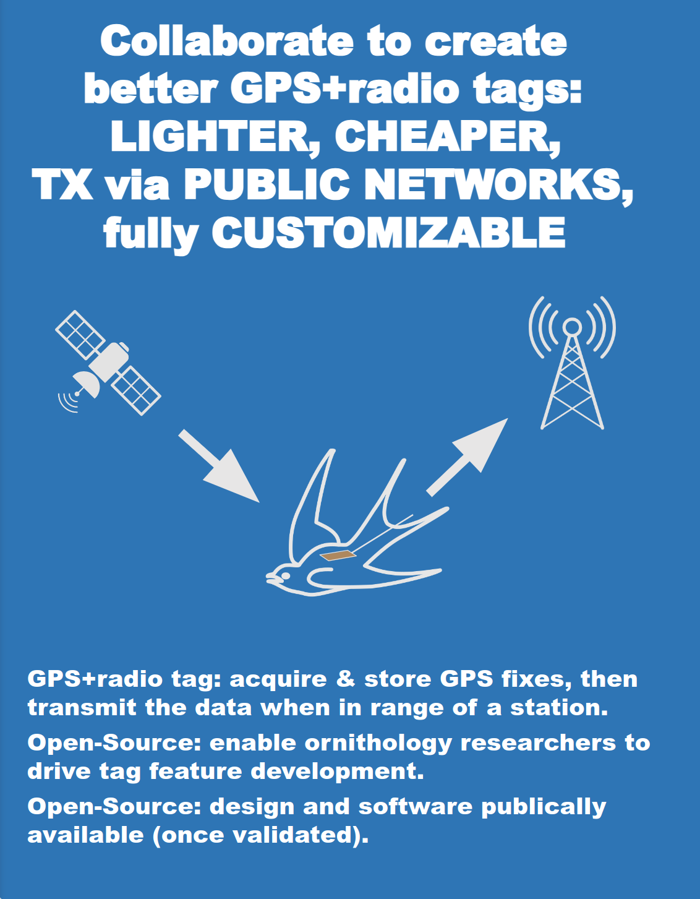
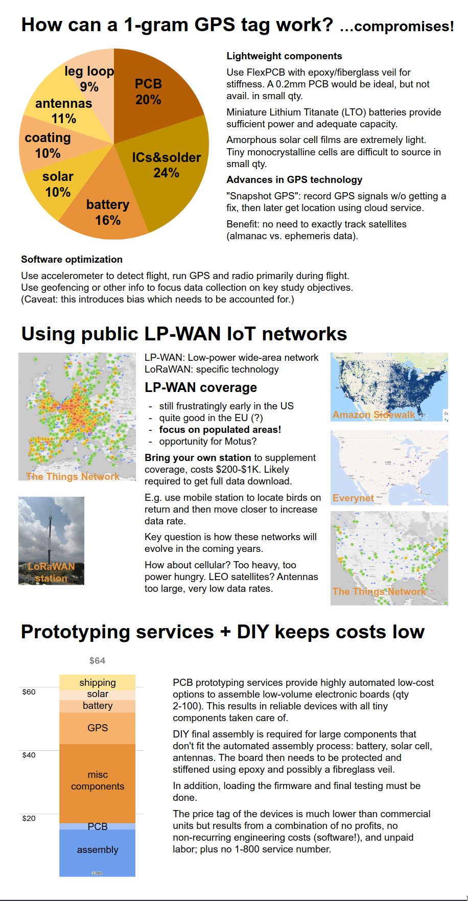
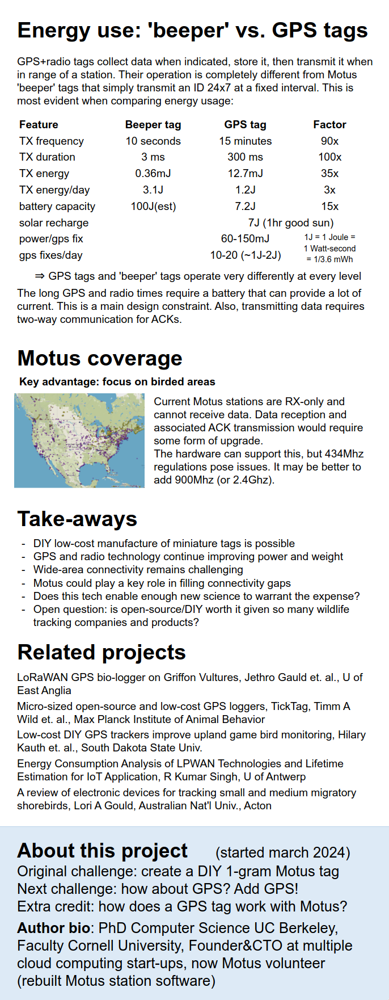

AOS 2024 Poster
===============

Poster presented at the
[2024 American Ornithological Society Annual Meeting](https://meeting.americanornithology.org/program/scientific-program-abstracts/).
Note that the [whitepapers](../whitepapers) section has expanded versions of the information in
the poster.

### The Challenge

- Is it possible to create DIY radio bird tracking tags that weigh 1 gram or less,
  compete in features with commercial offerings, are low-cost, and easy to assemble?
- GPS trackers are the gold standard but heavy and expensive: is it possible to create DIY
  GPS+radio bird trackers that weigh about 1 gram, are low-cost, and easy to assemble?
- In a world of ubiquitous wireless communications where does Motus fit in?

### Key Take-Aways

- Sub-gram DIY tags are possible and can be manufactured cheaply with simple final assembly by the user.
- Sub-gram DIY GPS tags are also possible and low-cost but do require more planning and configuration.
- Motus could enhance the usability of GPS tags by providing stations in bird-rich locations
  such that tags can upload stored data during the bird's migration.

## Poster

{width="70%"}
