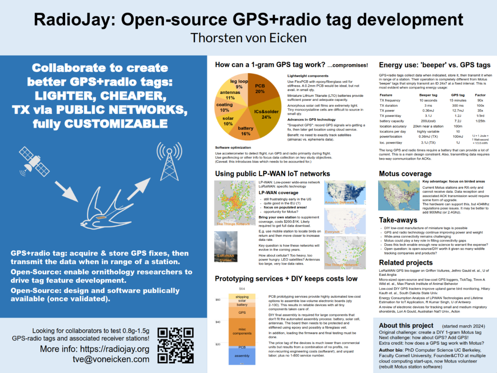

# Open-source lighweight bird trackers with radio.

{width="40%" align="right"}

The RadioJay project explores the feasibility of DIY open-source lightweight tracking
tags with radio transmission for tracking birds.
The primary goal is to be able to experiment with new technologies in order to enable new
ornithological research in bird migration or other activities.

The [tags](tags/index.md) section describes the RadioJay tags made so far. The "A" seriers contains
an altimeter and accelerometer and transmits the barometric pressure in a [Motus](https://motus.org)
compatible format. The "G" series explores the use of a GPS, storing the data on-board for
later transmission via radio.

The [whitepapers](whitepapers/index.md) section has short articles describing the various aspects of designing and
making the tags.

## AOS 2024 Poster

[{width="40%" align="left"}](aos-2024/index.md)

[Online version](aos-2024/index.md) of the information for the poster presented at the
[American Ornithological Society](https://americanornithology.org/) annual meeting 2024.
