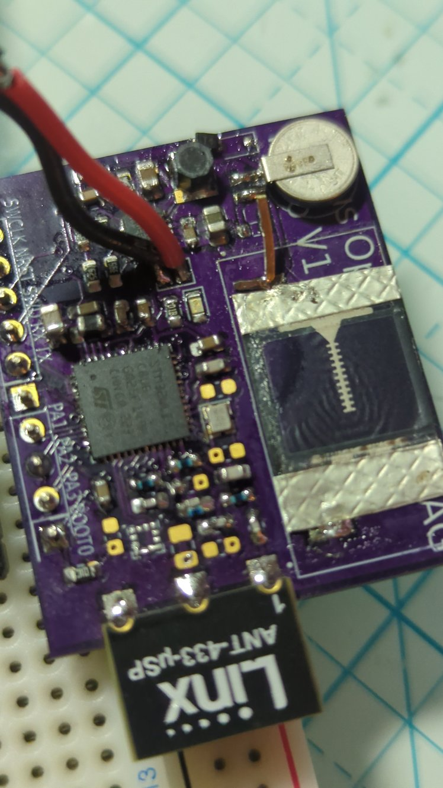

# RadioJay A1 Prototype

> Altimeter and accelerometer tag prototype with Motus compatible radio transmission

{width="40%" align="right"}
The RadioJay A1 prototype served to test:

- STM32 microcontroller with FSK radio
- Solar cell performance
- Rechargeable LiMn coin cell battery performance
- Energy harvesting circuit
- RF circuitry
- Accelerometer

It was designed to have a circuit layout that approximates a tag but with the bottom components
(battery and solar cell) folded flat to make everything more accessible for testing purposes.
A row of pin headers provides easy access to signals and a (heavy) chip antenna avoids a
long antenna wire.

## Issues found

### Insatisfactory battery performance

The battery chemistry, while having excellent power density, does not have the capability to
power radio transmissions.
This necessitates the use of a large capacitor to attempt to power the radio from the capacitor.
However, this still places too high a current on the battery with the effect of
reducing the usable battery capacity and leading to likely premature battery failure.
The net result is that a different battery chemistry was chosen for the next tag version.

### Start-up issues

While testing what happens if the battery is discharged below ~1.7V it was discovered that
the solar charging has difficulties recharging the battery.
The cause was tracked down to a misbehavior of a switching voltage regulator in the
microcontroller that oscillates between about 1.65V and 1.68V and causes excessive
power consumption. At the same time, the energy harvesting circuit is still in a
bootstrap mode and cannot overcome the power consumption.
A solution was found by increasing some capacitors, which may reduce low
light energy harvesting performance but avoid a dead tag.
