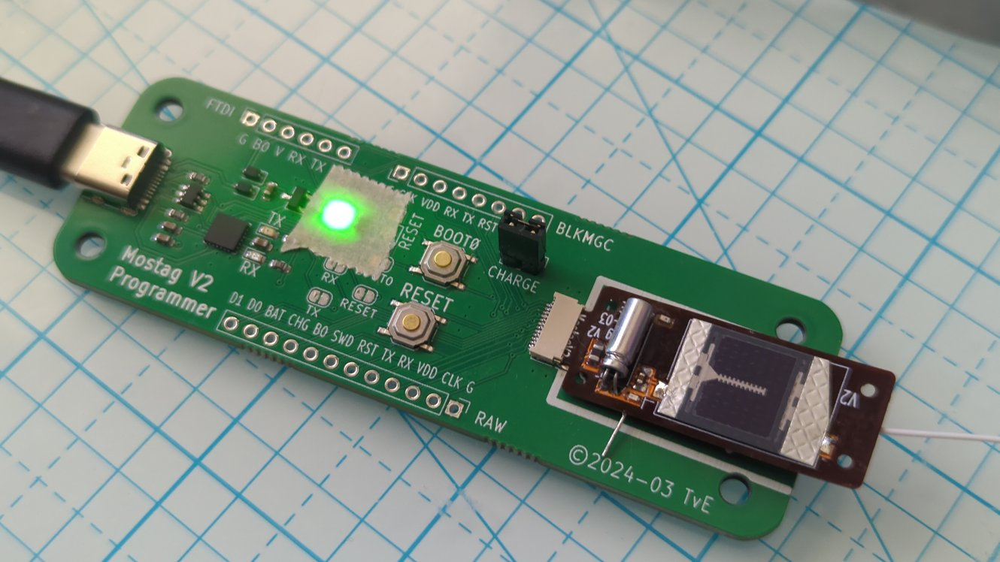

# RadioJay A2 Specifications

> One gram tag with altimeter, accelerometer, and extended Motus radio transmission

Background: the V2 tag was produced with two primary goals: to validate the integration of all the components and to prove the ability to meet a 1 gram target. It is a prototype produced on a minimal budget and as such it is expected to have problems, i.e., "room for improvement".

## Features

* Extended Motus/CTT compatible tag transmitting digitally coded presence and barometer data, optionally also animal activity data
* Solar power with rechargeable battery for "infinite" lifetime
* Highly configurable transmission data (instantaneous as well as past data)
* Highly configurable transmission intervals based on battery level, solar power, animal activity level, and approximate time-of-day.
* Sophisticated energy management to ensure any consumption is productive (no partial transmissions, for example).
* Four 1.5mm through holes at the corners for mounting.
* Target weight 1g

## Hardware

* Motus/CTT compatible 434Mhz FSK radio
* Transmission output power up to 10dBm
* Barometer with ~10cm resolution
* 3-axis accelerometer
* Rechargeable 2mWh battery with 4mW solar cell
* Weight with antenna excl harness: about 1 gram (depends on conformal coating thickness, assumes 0.2mm dia, 16-17cm long nitinol antenna)
* Dimensions: 38mm x 14mm x 4.5mm (excl antenna)

{width="48%"}
{width="48%"}

_Left: Lower side of tag, laying on top of programmer_.
_Right: Upper side of tag with battery and solar, inserted into programmer_.

## Cost

The cost for the PCBs and the components in qty 10 comes to less than $30.
The tags shown were hand soldered/assembled.
A batch of 50-100 tags could be ordered with assembly for about the same per-unit price,
leaving hand soldering of the battery, solar cell, and antenna.

## Modes of operation

### Simple modes

- **CTT presence**:
identical to CTT tag operation: transmit ID ("TX5") every N seconds

- **Altimeter mode**:
measure and transmit altimeter data (pressure + temperature, "TX11") every N seconds

- **Altimeter history mode**:
same as altimeter mode but also include altimeter values for previous 1..3 intervals to compensate for 
missed transmissions ("TX18")

- **Altimeter summary mode**:
same as altimeter mode, but also include summary data for a longer span, such as min/max/avg over past M minutes, or altitude bands visited in past M minutes ("TX18")

### Adaptive modes

- **battery adaptive**:
Reduce TX frequency when battery drops below 20% ("less data is better than no data");
increase TX frequency when battery is full

- **activity adaptive**:
Reduce TX frequency when animal is resting;
increase TX frequency and/or send special packets upon special event detection (e.g. dive)

- **pressure adaptive**:
Reduce TX frequency at uninteresting altitudes/pressures;
send special packets after rapid pressure changes (e.g. before/after pressures, rate of climb, …)

- **data adaptive**:
Reduce TX frequency when the data stays within a band;
increase TX frequency or send special packets when data crosses into another band

- **time adaptive**:
Modify TX frequency based on (approximate) time of day

Notes:

- "Special packets" could contain data different from standard ones, such as pressure before and after a dive, or time spent in previous pressure band when crossing into another one
- Adaptive modes and simple modes can be combined to create a program appropriate for the research objectives.

## Power budget

The following power specifications are intended to provide supporting data for configuring tags in a way that maximizes the data ultimately received. 

### Power production

* battery capacity: 6J (Joules = Watt-seconds)
* full-sun recharge empty-full: ~2-2.5 hours
* 25% sun recharge: (TBD)

### Power consumption by operation

Operation | Energy consumed (<strong>preliminary</strong>!) | Qty per charge (approx)
-- | -- | --
Sleep | 0.6J per day | 10 days
TX5 @5dBm | 126µJ ea | 47k
TX5 @10dBm | 149µJ ea | 40k
TX11 @5dBm | 209µJ ea | 27k
TX11 @10dBm | 248µJ ea | 24k
TX18 @5dBm | 307µJ ea | 19k
TX18 @10dBm | 364µJ ea | 16k
Barometer measurement | 80µJ ea | 75k
Accelerometer measurement | 10µJ ea? | 
Wake-up overhead | 10µJ ea? | 

- TX5: 5-byte CTT transmission (tag ID only)
- TX11: 11-byte transmission of TX5 plus barometer, temperature, battery level
- TX18: 18-byte transmission of TX11 plus recent or summary data

### Power consumption by operational modes

NOTE: these values assume zero solar recharge!

Mode of operation | Qty per charge | per charge at 10s interval
--|--|--
TX5 @10dBm "CTT" | 44k | 122 hours
TX11 @5dBm | 20k | 55 hours
TX11 @10dBm | 17k | 47 hours
TX18 @5dBm | 15k | 41 hours
TX18 @10dBm | 13k | 36 hours

## Alternative configurations

### Battery

The LTO battery used weighs 0.16g and has very high discharge capability in order to reliably support high power transmission. While a smaller 0.12g model exists it is not practical. However, slightly larger (and heavier) models can be fitted.

The tag could be redesigned around a primary (non-rechargeable) battery. This would eliminate the solar cell and energy harvesting circuit (~25% of PCB area for the latter) for some additional weight savings, primarily in PCB weight. As long as the battery voltage is between 1.8V and 3.6V no new voltage regulator circuit is required. From specs, a primary lithium battery has roughly 10x the energy density (Joules per gram) of the LTO battery and zinc-air roughly 20x, however, commercially available sub 1 gram batteries cannot source the current required for data transmission resulting in reduced actual capacity and often early failure, i.e., the tradeoff is complicated.

### Weight reduction

This tag was designed to a 1 gram target weight and uses a FlexPCB substrate (which is very economical in small qty but has its issues). It also uses components of a size that can be hand-assembled. A 100-unit run using automated assembly could shrink the tag to the size of the solar cell (12x18mm) and reduce the weight (excl. harness) to 0.7-0.8g. Lighter weights would require a different solar cell or a primary battery.
