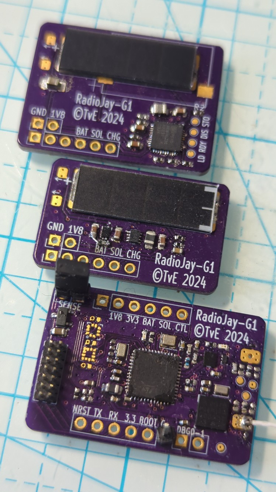

# RadioJay G1 Prototype

> GPS+radio tag prototype to test different GPS devices and solar cell options

{width="40%" align="right"}
The RadioJay G1 prototype serves to test:

- U-Blox M10 GPS
- IXSOLAR solar cell performance
- E-Peas AEM energy harvesting IC

to be continued...
