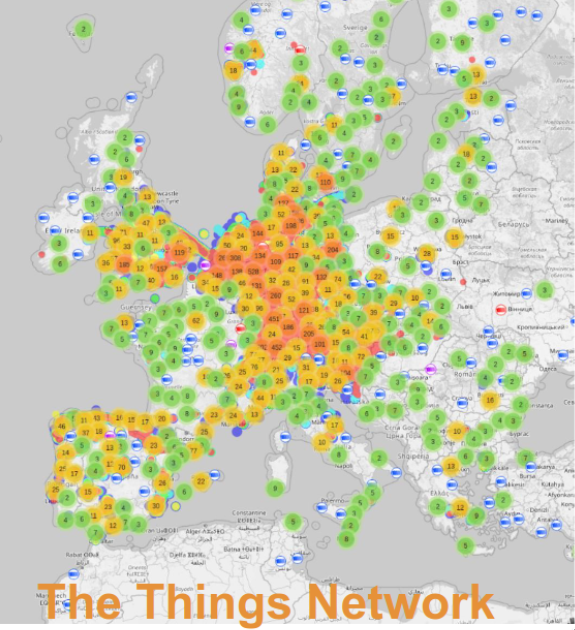
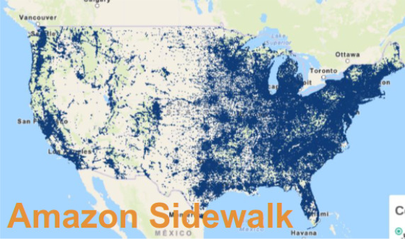
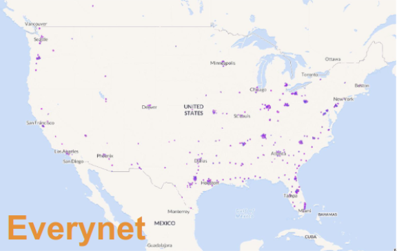
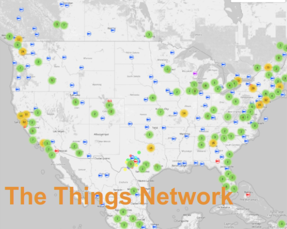
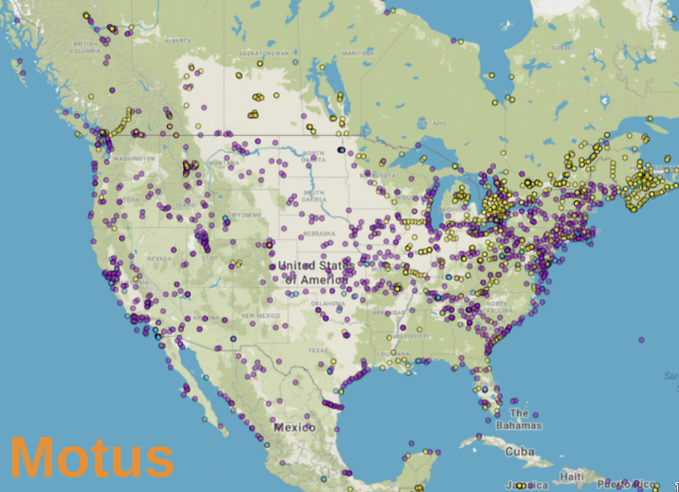

Motus tags that collect data
============================

The majority of [Motus](https://motus.org) tags transmit an ID at a fixed interval,
typically between 2 and 25 seconds.
The main piece of information that can be deduced from these transmissions is the presence of the
tagged animal in the radio range of the receiver at a specific moment in time.
Some additional information may be able to be gleaned from signal strength, sequence of directional
antennas that detect the tag, and overall duration of the detections.

## Adding some sensor data onto transmissions

It is tempting to complement the ID with additional data, this would allow the
reception of a transmission to convey more information.
One example of additional data is explored in a project focusing on
[tracking birds around offshore wind farms](https://motus.org/groups/Atlantic-Offshore-Wind/)
where the plan is to add a pressure sensor to tags and transmit the barometric pressure
together with the tag ID.

The issue with just tacking some data onto the transmission is that the data will only be collected
for the transmissions that are received by some station.
In the case of the offshore wind farms this is likely to work out because stations will be placed on
turbines, the flight altitude is of most interest near these turbines, and the probability of 
uninterrupted reception is high.
Essentially, the data transmitted near stations is of the highest interest and has the highest
chance of being received.

The wind farm project seems to be a rather special case where stations can be placed right where
the data is of highest interest and the obstruction-free ocean facilitates very predictable radio
coverage.
However, most bird studies that collect sensor data in addition to location make use of continuous
data sets for their analysis.
For example, tracking the activity pattern over days to deduce flight duration, speed,
as well as stop-over periods.
This type of continuous data is also used to calculate energy expenditure.
Altitude profiles are used to understand how migrating birds navigate changing weather conditions as
well as land profiles, e.g. mountain ranges, and how northbound and southbound migrations differ.

Tacking some data onto the current tag ID transmissions cannot support this type of study.
For example, a tag with a 5-second transmission interval sends out more than 3 million data points
over the course of 6 months, yet, typically at best a dozen of these are received by a very small
number of Motus stations. It seems inevitable that in most cases researchers need to use tags
with sensors that store the data on the tag, i.e., act as dataloggers, and then recover the data
at some later point in time.

## Tags that store data

Dataloggers that do not need to be physically retrieved are of great interest and have lead to the
development of "short range download" radio capabilities where a researcher in the vicinity of the
animal can download the data over a radio link. This raise the question whether there is a role for
Motus in this download process, e.g., does it make sense for tags to store the data and transmit
it to Motus when arriving in range of a station.

A good case can be made for adding such functionality to Motus, which is that the
short-range download does not work for species with low site fidelity where the returning bird
cannot be located and it also does not allow the data to be recovered when a bird leaves the area,
or when a tag is eventually lost enroute.

The difficulty with data download is that it requires two-way communication. The tag needs to know
when it is in range of a station, and it needs to receive acknowledgments so it knows which data
has been received so it can move on and transmit the next set of data records. Performing this two way communication is a very different mode of operation from current Motus stations which are receive-only.

The existing 434Mhz hardware in Motus stations could technically be upgraded via software to support
two-way communication and data download. However, the FCC rules (part 15.231e) for the 400Mhz band
only support this type of operation at rather low power and require a delay of at least 10 seconds
between transmissions.
The result is that this placese severe constraints on the amount of data a tag could download while
flying by a station.

## Public Low-Power Wide-Area Networks (LP-WAN)

For this type of long distance radio communication the three technologies that have been
most widely used are SixFox, LoRaWAN, and NB-IoT.
Sigfox does not appear to be useful in this context due to extremely low data rates and its
absense in north america.
NB-IoT is based on cellular networks and while very interesting because of its
widespread availability the power requirements exceed what 1 gram tags can support.
LoRaWAN has been deployed in many regions of the world and addresses lower power devices
than NB-IoT. It is the best suited for sub-gram bird trackers at this point in time.

All three technologies are used for public networks, i.e. shared networks to which one can connect one's
own device to communicate with one's own server. The network operates radio stations as well
as back-end servers that route packets between users' devices and their application servers.
In the case of Motus, the devices would be bird tracking tags and the application servers would be the
Motus back-end servers.

Most LoRaWAN public networks also support bringing one's own station, which means
that Motus and researchers can set-up stations in areas of particular interest and these stations
then supplement the network's existing stations.

While LoRaWAN is used in public networks it is often also deployed privately. For example,
municipalities can use a relatively small number of stations to cover a city area and
use it to collect data from various types of meters and sensors.

### Potential benefits

Remote download of tag data does not require a public network and in fact
several vendors offer GPS tags with remote download that operate using proprietary stations.
There are several benefits to using public networks and/or public network technology:

- some data can be uploaded via public stations as birds migrate
- bird migration can be tracked using public network stations allowing researchers to set-up
  mobile stations close to where the birds end up nesting or foraging, this reduces the guessing
  around when and where birds migrate to
- in the case of LoRaWAN there is a lot of low-cost station equipment readily available which
  makes setting up stations simple and economical
- the radio emissions regulations around public networks and their devices have been worked out
  and software libraries implementing the various requirements are available

## LoRaWAN

LoRaWAN is an ITU network and modulation standard that has found significant adoption in most parts
of the world. It is managed by the [LoRa Alliance](https://lora-alliance.org/about-lorawan/) and
enables device manufacturers to create devices independently of the network they end up being
deployed to. It also enables organizations to deploy their own networks and use off-the-shelf devices.

LoRaWAN uses radio chips very similar to the 434 Mhz ones Motus currently uses but they operate in the
900Mhz or 868Mhz range depending on region. The modulation scheme is spread spectrum enabling ranges
of 20-50 km while using a single simple omnidirectional antenna. The main downside is that the data
rate is very slow, often 1/10th of the current data rate used by Motus, which means that data
transmissions use more energy per bit.

An interesting aspect of LoRaWAN is that public networks have been deployed in several parts of the
world, which means that a tag could transmit data to existing stations at a very modest cost.
However, deployment in north america in particular is very spotty and it's not clear whether it
will grow to become ubiquitous (see coverage maps further down).
LoRaWAN is used by many local organizations (such as utility
meters and controls) but often these organizations set-up their own network infrastructure instead
of contracting with a public network. In general, many long distance tracking applications where
public networks are needed are more easily served by cellular communications.

The result is that there could be a very interesting role for Motus in complementing existing
public LoRaWAN infrastructure by filling in the coverage gaps with stations in areas that are
of interest to ornithologists.

The most relevant project to date in the
[tracking of Griffon Vultures](https://animalbiotelemetry.biomedcentral.com/articles/10.1186/s40317-023-00329-y)
in Portugal and Spain conducted by J. Gauld et. al. from the University of East Anglia.
They used LoRaWAN tags able to communicate with the public
[The Things Network](https://www.thethingsnetwork.org) but in the end opted to set-up
their own stations using off-the-shel equipment.

A new project is underway to
[track Guillemots](https://www.offshore-energy.biz/anglesey-birds-wearing-solar-powered-trackers-to-ensure-safe-tidal-energy-deployment/)
using LoRaWAN off the coast of Anglesey (Wales) but no detailed information seems to have been published.

## Sample energy analysis

The following table compares the energy consumption of a current Motus tag with a potential
LoRaWAN tag that stores data. LoRaWAN has the interesting characteristic that the tag can
decide at which data rate it transmits (there is a simple transmission duration vs. range tradeoff)
and the table below only shows the duration of a typical 120 byte packet at a "medium" data rate.
The point of the table is to show how the numbers differ by several orders of magnitude between
the two types of tags.

Feature           | Motus tag      | Stored data tag | Factor
--- | --- | --- | ---
TX frequency      | 10 seconds      | 15 minutes | 90x
TX duration       |  3 ms           | 400 ms     | 130x
TX energy         | 0.36mJ          | 12.7mJ     | 35x
TX energy/day     | 3.1J            | 1.2J       | 3x
battery capacity  | 100J(est)       | 7.2J       | 15x

(1J = 1 Joule = 1 Watt-second = 1/3.6 mWh)

The way a tag would work (this is how the LoRaWAN GPS bio-loggers deployed on Griffon Vultures
by J. Gauld et. al., U. of East Anglia worked) is as follows:

- the tag infrequently transmits an ID packet at a slow but long range data rate
- if a station receives the packet it responds with signal strength info (and records the detection
  of the tag)
- if the signal strength is too low to support a faster data rate the tag continues to probe the
  station at a slightly faster rate
- if the tag is close enough to the station it starts transmitting data at the highest reliable
  data rate, possibly switching data rate as it gets closer and then further away again

## Public LoRaWAN network coverage

The following maps compare the coverage of several public LoRaWAN networks (with a US focus) and
also show the corresponding Motus coverage.
It is very evident from the maps that the public networks focus on populated areas and specifically
on logistics hubs.
In contrast, Motus stations focus on areas where birds are expected to be present or migrate through.

Note that Amazon Sidewalk uses the same radio technology as LoRaWAN but uses a different
set of network protocols. It is not clear at this point whether it could be used for bird tracking,
i.e., whether the required Amazon certification could be obtained.
It is also only deployed in the US at this stage.

(Click on the maps to reach the official coverage map. Note that the Everynet map shows "possible
coverage" in the light shade.)

[{width="45%"}](https://ttnmapper.org/heatmap/)
[{width="45%"}](https://coverage.sidewalk.amazon/)
[{width="45%"}](https://coverage.sh/everynet?z=3.76&lat=45.34830&lng=-93.84699)
[{width="45%"}](https://ttnmapper.org/heatmap/)
[{width="45%"}](https://motus.org/dashboard/#)

To-do: figure out whether the Helium network is an option.

## LoRaWAN upload capacity

This section analyses how much data a tag can transmit per minute.
The idea is that a bird flies by a station and is in radio range anywhere
from a couple of minutes to 30-40 minutes.
During this time the tag can upload data to servers but the data quantity that can be uploaded
is limited by the transit time, tha data rate that can be achieved, and regulatory limitations.
The question is whether it is reasonable to expect a significant proportion of the stored data
to be uploaded or whether only a subset can be expected.

!!! note
    This section is work-in-progress.

### US915 band plan (americas)

In the US LoRaWAN offers the following for uplinks:

- Modulation parameters SF7BW125 through SF10BW125, typ 8 channels, 400ms max dwell time
  per channel
- Also available: SF8BW500, typ. 1 channel

Maximum payload size per data rate and resulting maximum data transferred per minute, assuming a 400ms packet every second:

DR | params | app payload | KB/minute
--- | --- | --- | ---
0 | SF10BW125 | 11 | 0.6
1 | SF9BW125 |  53 | 3
2 | SF8BW125 | 125 | 7
3 | SF7BW125 | 222 | 13
4 | SF8BW500 | 222 | 26

#### Sample calculations

- GPS fix represented using 10 bytes
- Snapshot GPS recording represented using 48 bytes
- Assume 10 minute periods, for example, a bird may fly by a station in 30 minutes and have 10 minutes
  at each of DR 0, 2, and 4.

DR | Fixes/10min | Recordings/10min
--- | --- | ---
1 |  300 |  64
3 | 1300 | 225
4 | 2600 | 550

### EU868 band plan (Europe)

- Modulation parameters SF7BW125 through SF12BW125, typ 8 channels, 1% duty cycle per sub-band (2)
- Also available: FSK, type 1 channel, 0.1% max duty cycle

DR | params | app payload | air time | KB/minute
--- | --- | --- | --- | ---
0 | SF12BW125 | 51 | 2794ms | 0.02
1 | SF11BW125 | 51 | 1561ms | 0.04
2 | SF10BW125 | 51 | 698ms | 0.08
3 | SF9BW125 |  115 | 677ms | 0.2
4 | SF8BW125 | 242 | 215ms | 1.3
5 | SF7BW125 | 242 |  118ms | 2.4
7 | FSK 50kbps | 242 | 42ms | 0.34

The above table assumes the duty cycle limits as they apply to The Things Network bandplan.
There is an alternative, which is listen-before-talk that removes the duty cycle limitation,
it is not clear what the ramifications of this option are.
In addition, there is a relatively new (2020?) allocation without duty cycle limitation but with
transmit power limitations in a portion of the band not used by The Things Network and it could
be used by privately set-up stations. (It's complex!)

References:

- [LoRaWAN regional parameters](https://resources.lora-alliance.org/technical-specifications/rp002-1-0-4-regional-parameters)
- [The Things Network fundamentals](https://www.thethingsnetwork.org/docs/lorawan/)
  [TTN frequency plans](https://www.thethingsnetwork.org/docs/lorawan/frequency-plans/)
- [FCC title 47 section 15.247](https://www.ecfr.gov/current/title-47/chapter-I/subchapter-A/part-15/subpart-C/subject-group-ECFR2f2e5828339709e/section-15.247)
- [ETSI EN 300 220-2](https://www.etsi.org/deliver/etsi_en/300200_300299/30022002/03.01.01_60/en_30022002v030101p.pdf) (Annex B is the most readable)
