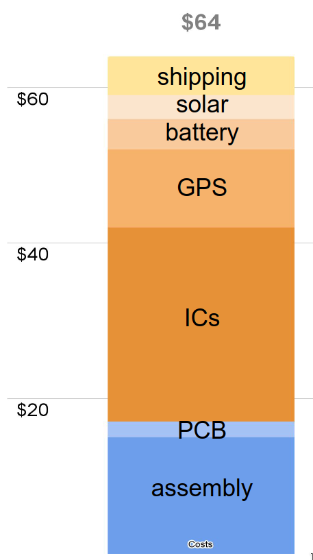

Manufacturing tags and costs
============================

To manufacture the tags in small qty (10-100) the best option is to use PCB prototyping services
that manufacture the FlexPCBs and assemble surface mount components.
The result is that all the tiny surface mount components are machine placed and soldered.
The remaining assembly is to solder large components to the tag: solar cell, battery, and antenna.

The next step is to protect the tag from moisture with conformal coating, typically by spraying on
or dipping the tag into an acrylic or epoxy compound. In addition, a prepared fiberglass veil
should be placed over the electronic components to stiffen the tag and smoothen over the sharp edges
of the components.

Finally the tag needs to be tested, which involves loading test firmware that can exercise all the
functions. For a proper test the tag needs to be cycled through various environments such as
different GPS signal quality as well as various sunlight exposures and the tag's performance needs
to be monitored over several days. Properly functioning tags can then be programmed with the
final firmware and configured as desired.

{width="40%" align="right"}

Costs
-----

The cost to manufacture the tags is shockingly low compared to commercial GPS tags that typically
have a price tag above $1000.
This is because the manual assembly and testing tasks are performed by the user and the software
is provided for free, i.e., there is no charge for the non-recurring engineering costs.
The bottom line is that even in small quantities the tags should cost less than $70, possibly as low
as $30-$40.

The biggest caveat about the price is the manufacturing risk. If a batch of tags ends up not working
due to an error it is unlikely that one can recover much of the costs. The PCB manufacturer may
reimburse some of the assembly costs but that still leaves the cost of all the components.
