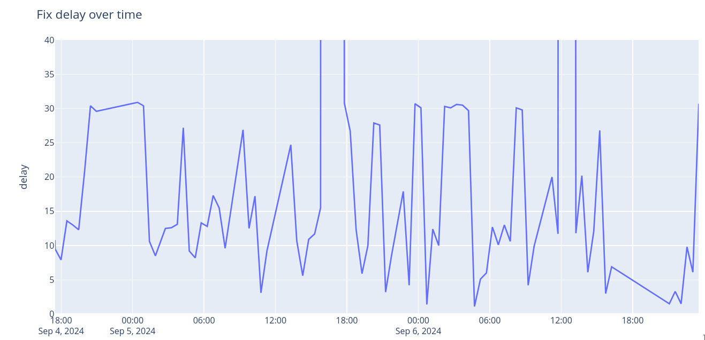
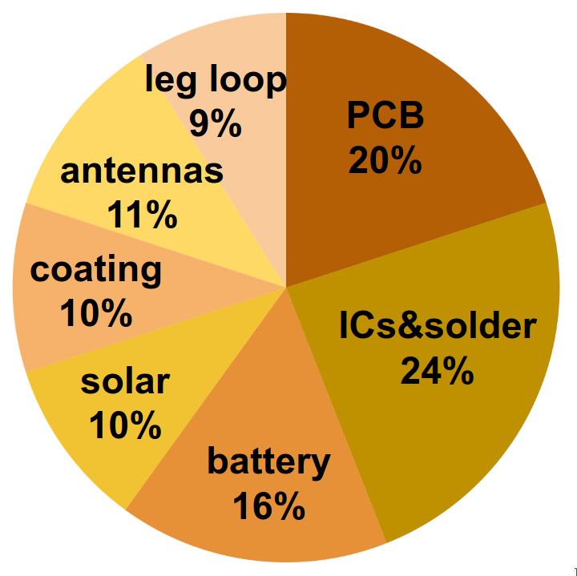

Ultra-lightweight GPS bird tags
===============================

As of 2024 the smallest commercially available GPS tags with radio download of the data weigh
over 2 grams.
Is it at all possible to create such GPS+radio tags that weigh under 1 gram?

There are several limiting factors to GPS and radio tags.
The main one is power consumption and addressing it requires a whole system engineering approach.

Power consumption
-----------------

The power consumption of a GPS device poses two issues when it comes to using tiny batteries.
The instantaneous power consumption (e.g. watts) exceeds the capabilities of most small
batteries and the total energy consumption (e.g. watt-hours) strains what can be stored on
a sub-gram tag.
Both issues apply to the radio used to download the data from a distance just as well, after all,
a GPS device is primarily a radio with some fancy signal processing.

### Snapshot GPS

Another issue with GPS is the updating of satellite data. In order to calculate a fix a GPS
device needs to know the exact orbit data of the satellites and keeping this data up-to-date
places a lower bound on the amount of time the GPS device has to be turned on per day, which in
turn places a lower bound on the daily energy requirements.

<figure markdown="span">
  
  <figcaption>Time to acquire a GPS fix when asking the GPS for a fix every 75 minutes.
  Many fixes take around 4 to 14 seconds but every couple of hours the GPS takes around 30 seconds
  to acquire a fix because it first needs to receive the satellite orbit information (ephemeris).
  </figcaption>
</figure>

To be specific, the orbit data for each satellite is valid for 3-4 hours and takes 6 seconds to
receive and there are around 24 satellites that need to be used over the course of a day.
State of the art GPS receivers can produce a fix in as little as 4 seconds from wake-up
if they have all the up-to-date data, but if they don't they first have to receive the
6-second information for all satellites in view before they can calculate a fix.
The result is an on-time of around 30 seconds assuming good reception.

The solution to this problem is not to calculate a fix in the device. This is sometimes called
"snapshot GPS": the device records the satellite signal timing, stores it locally together
with an acquisition timestamp, and once this information is retrieved from the device a cloud
service combines it with satellite orbit data to calculate the position. The result is that the
GPS device only needs to turn on for about 4 seconds when a position is desired but the
downside is that the device doesn't get to know its position and thus cannot implement features
such as geofencing.

### High current batteries

A fundamental issue with pretty much all radios on sub-gram tags is the instantaneous power
consumption during transmit and receive. Modern radio integrated circuits consume on the order
of 6-10mA @3.3V when receiving and up to 20mA when transmitting (at 5-10dBm).
These short high current peaks clash with the fact that sub-gram batteries are designed to
produce tiny constant currents for a long time,
for example to provide battery backup for memory or to power hearing aids.
The current these batteries can provide is measured in µA, for example a 0.11g SR416SW battery
(1.55V) is designed for a discharge current of 10µA.

In typical coded VHF or UHF radio tags the low power capabilities of the batteries
is compensated for by using a large capacitor to power the radio transmission. Basically the
battery charges the capacitor and the transmission uses this charge, after which the capacitor is
recharged slowly from the battery.
Aside from reliability issues due to the strain on the battery during the capacitor recharge,
this is only feasible for very short transmissions of less than around 10ms
(e.g. Lotek tags use 2.5ms pulses and
CTT tags transmit their ID in 2.8ms).
The use of a capcitor is not a solution to power a GPS for several seconds.

One solution is to use recently introduced rechargeable Lithium Titanium Oxide (LTO) batteries.
These batteries are related to the common Li-Ion batteries found in many high-power consumer
electronics but have even higher current capabilities at the expense of a somewhat lower energy
density. There are miniature LTO batteries available that weight 0.16g and are designed to
provide 16mA at 2.5V, which is just enough to power a GPS or a radio transmission.

The downside of the rechargeable LTO batteries is that they hold only 10th the energy as compared
to the best non-rechargeable cells. The work-around used in RadioJay tags is a combination of
smart scheduling of GPS activations as well as solar recharge.

The use of solar recharge is a mixed bag: on the one hand it allows tags to function "forever"
(until they fall off...)
but on the other hand they cannot be used on nocturnal species, such as bats, and they may not
function adequately on species where the flight feathers tend to cover the solar cell.
Implementing a solar cell also requires space and thus weight, both for the solar cell itself as well
as for the charging circuit that boosts the solar cell voltage to a level appropriate for charging
a battery.

Tiny solar cells are difficult to source in small quantities for DIY tags. The industry is focused
on ever larger cells and panels to power grid applications. Nevertheless very lightweight
amorphous silicon cells are available that weigh just under 0.1g. This technology produces
less power per area than monocrystalline cells but performs better in shaded conditions (and
most likely when partially obscured under feathers).

1 gram GPS tag composition
--------------------------

In order to produce a 1 gram tag clearly the lightest possible components must be used.
Some of the fixed weights are the battery, solar cell, antennas, and the attachments method,
such as leg loop or glue blob.

The parts that can be optimized or compromised on are the printed circuit board (PCB), the
coating/housing, and the attachment method. The weight of the PCB is a function of its area
and thickness. To reduce the area the smallest and most integrated solutions must be chosen and all optional
components must be eliminated.

Routine manufacturing is possible down to components smaller
than 1mmx1mm as well as ball-grid-arrays (BGA). The PCB thickness is more of an issue because
prototyping services offer 0.6mm thickness as the minimum before prices rise dramatically.
However, recently flexible PCBs (FlexPCB) that are under 0.2mm thick have become available:
these are normally used to
produce flat wires with many conductors used in equipment like laptops, screens, phones, etc.

The FlexPCBs can hold components but have the issue that larger ICs, such as microcontrollers,
do not tolerate flexing.
The proposed solution is to use a fiberglass veil (very thin fiberglass fabric in an epoxy matrix) to add
stiffening and to smoothen the surface of the tags.
Mmore experimentation and real-world experience is needed.
Using a conventional plastic housing or epoxy potting is not feasible given the weight constraints.

{width="40%" align="left"}
 

component |	grams
--- | ---
PCB	| 0.20
chips&solder | 0.24
battery | 0.16
solar cell | 0.10
coating | 0.10
antennas | 0.11
leg loop | 0.09

 
